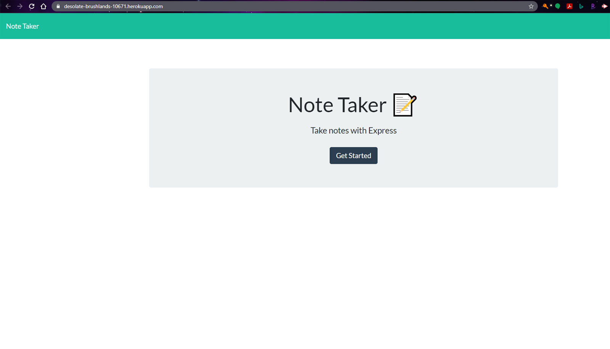

# Note Taker

## Table of Contents
  * [Description](#description)
  * [Usage](#usefaq)
  <!-- * [Installation](#install)
  * [Testing](#test) -->
  * [License](#license)
  <!-- * [Credits](#credits) -->
  * [Demo Video](#demo)
  * [Contributing to This Repo](#contributefaq)
  * [Questions / Contact Details](#questions)

  
## Description
Create an application that can be used to write, save, and delete notes. This application will use an express backend and save and retrieve note data from a JSON file.

## Usage
AS A user, I want to be able to write and save notes

I WANT to be able to delete notes I've written before

SO THAT I can organize my thoughts and keep track of tasks I need to complete

<!-- 
## Installation
npm i -->

<!-- 
## Testing
npm test -->

## License
The application is covered under a MIT license.

<!-- 
## Credits -->
<!-- Background image is a free to use image that was obtained from [Pexels.com](https://www.pexels.com/). -->

## Demo Video
<!-- A video demonstration of this application can be found [here](https://youtu.be/XwDZOvQD080).
Click the image to launch the video. -->

<!--  -->

## Contributing to This Repo
Please Contact me.

## Questions / Contact Details
This app can be found on my Github page at [TreeGee73](https://github.com/TreeGee73).

If you have any questions or need to contact me about this app, I can reached either on Github or by email at [treegee73@gmail.com](treegee73@gmail.com).
